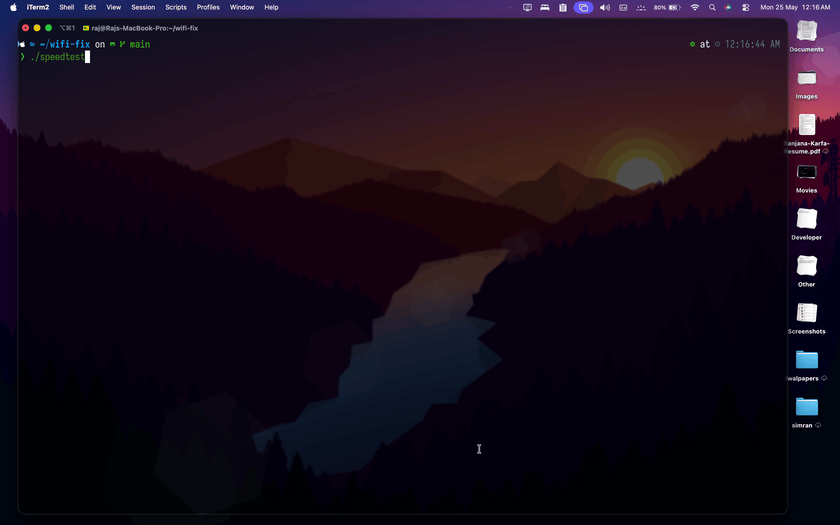

# speedtest

Animated terminal speedtest. Go + Bubble Tea TUI on top of [`speedtest-go`](https://github.com/showwin/speedtest-go).

Streams live ping, jitter, download, and upload from the nearest Ookla server with gradient bars and stage transitions.



## Install

```bash
go build -o speedtest .
```

Requires Go 1.25+.

## Run

```bash
./speedtest
```

Quits on `q` or `ctrl+c`. Final summary prints after alt-screen exits.

## Layout

```
main.go                    entrypoint
internal/engine/engine.go  speedtest pipeline, streams Update over channel
internal/ui/ui.go          Bubble Tea model, lipgloss styling
```

Engine emits staged `Update` values (`init` → `user` → `servers` → `ping` → `download` → `upload` → `done`). UI consumes channel, renders frame.

## Stack

- `charmbracelet/bubbletea` — TUI runtime
- `charmbracelet/lipgloss` — styling
- `showwin/speedtest-go` — Ookla client
